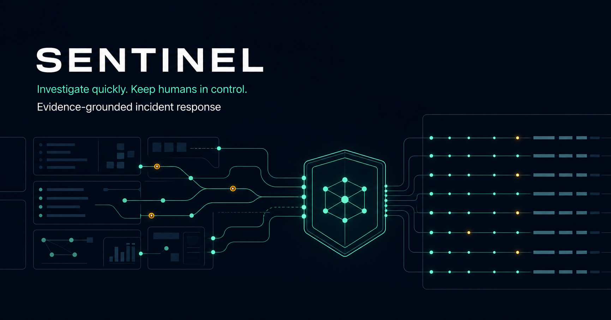
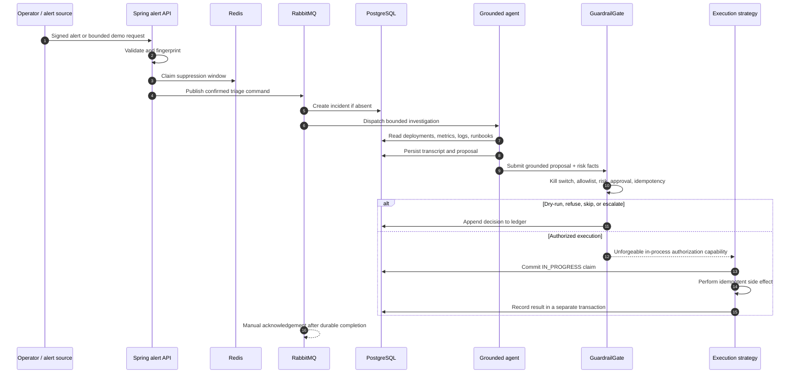

# Sentinel

<p align="center">
  <strong>Evidence-grounded incident response with deterministic safety controls.</strong>
</p>



<p align="center">
  <a href="https://sentinel-mofazzal874.centralindia.cloudapp.azure.com/"><strong>Open the live system</strong></a>
  ·
  <a href="docs/DEMO_GUIDE.md"><strong>Follow the guided demo</strong></a>
  ·
  <a href="docs/PROJECT_JOURNAL.md"><strong>Read the engineering journal</strong></a>
</p>

<p align="center">
  <a href="https://github.com/Mofazzal874/Sentinel-Autonomous-On-Call-Incident-Response-Agent/actions/workflows/deploy-azure-demo.yml"></a>
  
  
  
  
</p>

Sentinel is a full-stack autonomous on-call and incident-response system. It accepts operational alerts, creates one durable incident, correlates deployments, metrics, logs, and runbooks, asks a bounded AI workflow to propose a response, and passes every proposed infrastructure mutation through deterministic Java guardrails.

The central rule is simple:

> The model may investigate and propose. It never authorizes itself.

This is not a chatbot wrapped around synthetic text. It is a transactional Spring control plane with asynchronous delivery, vector retrieval, idempotent execution, role-based security, human approval, an append-only audit ledger, a production-shaped digital twin, an interactive Next.js operator console, and automated Azure delivery.

## At a glance

| Product evidence | Current implementation |
|---|---:|
| Seeded operational world | 4 teams, 12 services, 30+ coherent incidents |
| Evidence scale | 10,000+ metrics, 750+ structured logs, 50+ deployments |
| Public incident inputs | 12 services × 4 failure families × severity × impact × signal × change context |
| Safety outcomes | 7 deterministic gate decisions |
| Verification | 113 backend tests + 6 frontend tests |
| Deployment | Immutable GHCR image, Azure OIDC, stable HTTPS URL |

## Contents

- [Try the live system](#try-it-before-reading-the-code)
- [The problem](#the-problem-sentinel-solves)
- [User capabilities](#what-a-user-can-do)
- [Architecture and incident sequence](#architecture)
- [AI and safety boundary](#why-this-is-not-ai-with-a-dangerous-tool)
- [Retry and crash correctness](#correctness-under-retries-and-failure)
- [Digital twin and technology map](#production-shaped-digital-twin)
- [Run locally](#run-locally)
- [Verification](#verification)
- [Security](#security-boundary)
- [Azure CI/CD](#automated-azure-delivery)
- [Engineering journal](#engineering-journal-how-sentinel-grew)
- [Documentation map](#documentation-map)
- [Limitations and direction](#honest-limitations-and-ambitious-direction)

---

## Try it before reading the code

The public deployment is available at:

### [sentinel-mofazzal874.centralindia.cloudapp.azure.com](https://sentinel-mofazzal874.centralindia.cloudapp.azure.com/)

Use the [step-by-step demo guide](docs/DEMO_GUIDE.md) if this is your first incident-response system. The shortest meaningful journey is:

1. Open **Overview** to understand the operator problem and see live PostgreSQL totals.
2. Open **Live lab** and select a service, failure type, severity, signal strength, customer impact, and deployment context.
3. Create the investigation. Sentinel persists evidence, publishes durable work, invokes the real CPU-hosted model, and records a generated public UUID.
4. Wait for the model. The Azure demo favors a real local model over a fake instant response, so a full investigation can take several minutes.
5. Open the report and inspect **Response brief**, **Evidence & AI**, **Raw console**, **Safety decision**, and **Audit ledger**.
6. Open **Learn** for the interactive system-design course and knowledge checks.

The public environment is intentionally dry-run. It demonstrates the complete decision path without granting an anonymous visitor authority over infrastructure.

## The problem Sentinel solves

An alert rarely contains a root cause. During an outage, an on-call engineer typically has to join several incomplete views:

- an alert says a threshold fired;
- metrics show when the service changed;
- logs reveal symptoms and trace identifiers;
- deployment history shows what changed;
- runbooks describe approved operational responses;
- permissions determine what may actually happen.

AI can summarize this evidence, but letting probabilistic output directly mutate infrastructure creates a second incident risk. Sentinel separates investigation intelligence from execution authority.

| Question | Sentinel owner |
|---|---|
| Did we receive and persist the alert? | Spring, RabbitMQ, PostgreSQL |
| Is this a duplicate or retry? | Redis efficiency + database uniqueness |
| Which evidence should be read? | Deterministic Java routing |
| What probably happened? | Bounded AI classification and synthesis |
| Is the proposal grounded? | Retrieved evidence + bounded evaluator |
| Is the action allowed and low risk? | Deterministic `GuardrailGate` |
| Did this action already happen? | Durable action claim and idempotent strategy |
| Who approved or executed it? | JWT/RBAC + append-only ledger |

## What a user can do

### Public portfolio visitor

- Explore a deterministic operations digital twin.
- Search coherent incident histories across multiple services and outcomes.
- Configure and create a new bounded synthetic incident.
- Watch durable queue and agent progress.
- Inspect the raw metrics, logs, deployments, runbook, AI transcript, risk decision, and ledger produced by that run.
- Learn the design through an interactive six-module course.

### On-call engineer or viewer

- Read the fleet and bounded incident queue through JWT-protected APIs.
- Correlate time-windowed operational evidence without loading entire telemetry tables.
- Review the incident narrative, likely cause, recommendation, and safety result.

### SRE approver

- Review higher-risk remediation requests.
- Approve or reject them with a dedicated role.
- Re-enter the same safety gate after approval; approval does not bypass policy.

### Platform administrator

- Manage teams, services, dependencies, runbooks, and sandbox scenarios through generated-ID CRUD.
- Control allowlists, dry-run policy, and the kill switch.
- Receive optimistic-locking conflicts instead of silently overwriting concurrent edits.

## Architecture

```mermaid
flowchart LR
    subgraph Inputs[Inputs and operators]
        Alert[Signed alert webhook]
        Console[Next.js operator console]
        Approver[SRE approver]
    end

    subgraph Control[Spring Boot control plane]
        DemoAPI[Demo and read APIs]
        Intake[Validate + fingerprint]
        Suppress[Redis storm suppression]
        Queue[RabbitMQ durable queue]
        Incident[Incident transaction]
        Tools[Bounded read tools]
        Agent[AI router + proposal + evaluator]
        Gate[Deterministic GuardrailGate]
        Execute[Idempotent strategy]
        Ledger[Append-only action ledger]
    end

    subgraph Data[Authoritative data]
        Postgres[(PostgreSQL 17)]
        Vector[(pgvector runbooks)]
    end

    Alert --> Intake --> Suppress --> Queue --> Incident
    Console -->|read DTOs / create bounded demo| DemoAPI
    DemoAPI -->|new demo alert| Intake
    DemoAPI -->|bounded projections| Postgres
    Incident --> Postgres
    Incident --> Tools
    Tools --> Postgres
    Tools --> Vector
    Tools --> Agent
    Agent -->|proposal only| Gate
    Approver -->|JWT SRE_APPROVER| Gate
    Gate -->|dry-run / refuse / escalate| Ledger
    Gate -->|authorized capability| Execute --> Ledger
    Ledger --> Postgres
```



### One incident, end to end



## Why this is not “AI with a dangerous tool”

Sentinel deliberately gives the model less authority than a normal operator.

- Read tools are typed, bounded, validated, side-effect free, and return DTOs.
- Mutating operations are never exposed as model tools.
- Evidence selection is deterministic Java, not model discretion.
- Missing authoritative evidence escalates instead of producing an invented fix.
- Model and evaluator loops have explicit call and iteration bounds.
- The safety-critical path contains no LLM.
- Every execution path requires a capability created only by the gate.
- The database, not Redis, provides durable duplicate protection.
- Human approval re-checks the kill switch, allowlist, grounding, risk, and idempotency rules.

The gate can produce `REFUSE`, `ESCALATE`, `SKIP`, `DRY_RUN`, `REQUIRE_APPROVAL`, `AUTO_EXECUTE`, or `APPROVED_EXECUTE`. In the public Azure environment, dry-run remains enabled.

## Correctness under retries and failure

Sentinel assumes the network and process can fail at inconvenient moments.

```text
Redis claim        = fast alert-storm efficiency
PostgreSQL UNIQUE  = durable incident correctness
RabbitMQ ack       = only after durable processing
Action claim       = committed before external side effect
Strategy           = idempotent because crashes can happen after the effect
Result record      = separate transaction after the effect
Compensation       = a new fact; history is never erased
```

This design handles the classic uncertainty window where a side effect succeeds but the process crashes before recording success.

## Production-shaped digital twin

The public environment does not copy customer data or a large external benchmark into the repository. It generates an original, deterministic operational world whose topology and anomaly shapes are informed by modern AIOps datasets.

The baseline includes:

- 4 teams and 12 services across checkout, payments, catalog, identity, notifications, and platform domains;
- explicit dependency edges and service criticality tiers;
- more than 50 deployments with successful, failed, rolled-back, and incident-correlated releases;
- at least 10 versioned runbooks;
- at least 30 coherent incident histories across severity and terminal outcomes;
- more than 10,000 metric samples and 750 structured log events with trace IDs;
- bad releases, capacity exhaustion, dependency failures, stale caches, ambiguous evidence, denied actions, dry-runs, approvals, auto-resolution, and compensation histories.

New visitor-created investigations are not frontend constants. The backend persists the chosen service, symptom, severity, signal intensity, customer impact, and deployment context, then creates 60 time-series samples, eight logs, an optional deployment, and a durable incident workflow around that input.

## Technology and responsibility map

| Technology | Responsibility |
|---|---|
| Java 25, Spring Boot 4.1, Spring Framework 7 | API, application services, transactions, validation, scheduling |
| Spring Security, JWT resource server | Stateless authentication, RBAC, method guards |
| Spring Data JPA, Hibernate 7 | Domain persistence with explicit service transactions |
| Flyway | Forward-only schema ownership and validation |
| PostgreSQL 17 + pgvector | Incidents, telemetry, runbooks, transcripts, vector retrieval, action history |
| Redis 7 | Alert storm suppression and bounded model-call budgets |
| RabbitMQ 4 | Durable at-least-once triage with manual acknowledgement, retries, and DLQ |
| Spring AI 2.0, Ollama, Qwen3 4B | Structured classification, grounded proposal, bounded critique |
| Nomic Embed Text | 768-dimensional runbook embeddings |
| Next.js 16, React 19, Motion, Lucide | Static-exported interactive operator experience |
| Micrometer, Actuator, OpenTelemetry | Metrics, health, traces, protected Prometheus endpoint |
| JUnit, Testcontainers, Vitest | Deterministic, integration, security, and UI verification |
| Docker Compose, Caddy | Repeatable infrastructure, TLS, same-origin delivery |
| GitHub Actions, GHCR, Azure OIDC | Test, immutable image publication, passwordless exact-VM deployment |

## Repository map

```text
src/main/java/io/mofazzal/sentinel/
├── alert/          signed intake, suppression, RabbitMQ topology and consumer
├── fleet/          services, dependencies, telemetry and catalog lifecycle
├── incident/       durable incident creation and bounded query API
├── tools/          typed read-only deploy, metric, log and runbook tools
├── agent/          routing, orchestration, retrieval, transcript and evaluation
├── guardrail/      deterministic risk, policy, approval and single gate
├── execution/      authorized idempotent strategies and compensation
├── ledger/         action claims and append-only decision/result history
├── observability/  metrics, observations and trace boundaries
├── security/       JWT/RBAC and signed-webhook verification
└── demo/           digital twin and bounded public investigation workbench

frontend/           Next.js operator console and interaction tests
src/main/resources/db/migration/
                    immutable Flyway history, V1 through V10
observability/      Prometheus rules and Grafana dashboard
deployment/         local rehearsal, Azure bundle, OIDC and cost controls
docs/               journal, learning course, ADRs, evaluation and runbooks
```

## Run locally

### Prerequisites

- Git
- Java 25 LTS
- Node.js 20.9 or newer
- Docker Desktop or another Docker-compatible engine with Compose
- PowerShell on Windows for the provided convenience scripts

No global Gradle installation is required; the checked-in wrapper owns the Gradle version.

The development machine used for this project keeps Java, npm/Gradle caches, Docker data, and model files on `E:` because `C:` is space constrained. Those paths are a local policy, not a runtime requirement for other contributors.

### 1. Initialize local secrets and cache locations

From the repository root:

```powershell
. .\scripts\dev-env.ps1
```

The script creates ignored local JWT and webhook secrets once under `.sentinel/`. It reuses them and never prints their values.

### 2. Start PostgreSQL, Redis, and RabbitMQ

```powershell
docker compose up -d --wait
docker compose ps
```

Local endpoints:

| Service | Address |
|---|---|
| PostgreSQL/pgvector | `localhost:55432` |
| Redis | `localhost:6379` |
| RabbitMQ AMQP | `localhost:5672` |
| RabbitMQ management | http://localhost:15672 |

PostgreSQL uses `55432` so Sentinel does not interfere with another PostgreSQL installation using `5432`.

### 3. Build the frontend and start Sentinel

```powershell
$env:npm_config_cache='E:\DevCaches\npm'
npm --prefix frontend ci
npm --prefix frontend run build

.\gradlew.bat bootRun --args="--spring.profiles.active=seed,demo"
```

Open http://localhost:8080.

The `seed,demo` profiles are for a synthetic environment only. Never enable them against a real operational database.

### 4. Exercise protected APIs

Create a short-lived viewer token:

```powershell
$token = .\scripts\new-dev-token.ps1 -Role VIEWER -Subject local-viewer

Invoke-RestMethod http://localhost:8080/api/v1/fleet/services `
  -Headers @{ Authorization = "Bearer $token" }

Invoke-RestMethod 'http://localhost:8080/api/v1/incidents?status=OPEN&limit=20' `
  -Headers @{ Authorization = "Bearer $token" }
```

For the protected **Admin** workspace:

```powershell
$adminToken = .\scripts\new-dev-token.ps1 -Role ADMIN -Subject local-admin
```

Paste the token into the Admin screen. It remains in page memory; the helper is a local convenience, not a production identity provider.

### 5. Stop local infrastructure

```powershell
docker compose down
```

Named volumes intentionally preserve database, Redis, and RabbitMQ state. Add `--volumes` only when you explicitly want to destroy the local Sentinel data.

## Verification

Normal regression tests never call a real model.

```powershell
.\gradlew.bat clean test
npm --prefix frontend test
npm --prefix frontend run typecheck
npm --prefix frontend run build
npm --prefix frontend audit --audit-level=moderate
```

The latest complete local gate passed:

- 113 backend tests across 38 suites;
- 6 frontend interaction/API tests;
- zero backend failures, errors, or skips;
- strict TypeScript compilation;
- successful Next.js static export;
- zero npm vulnerabilities at the configured audit level;
- PostgreSQL, pgvector, Redis, and RabbitMQ Testcontainers coverage for the live workflow.

Live-model evaluation is intentionally opt-in:

```powershell
$env:SENTINEL_EVAL_SPLIT='HOLDOUT'
$env:SENTINEL_EVAL_MODE='ROUTING_RETRIEVAL'
.\gradlew.bat liveAgentEvaluation --no-daemon
```

Read the [evaluation method](docs/evaluation/README.md) and the [measured Qwen3 4B baseline](docs/evaluation/2026-07-19-qwen3-4b-baseline.md) before interpreting results. The corpus is deliberately small and the documentation does not claim production-quality model accuracy.

## Security boundary

Roles are `VIEWER`, `SRE_APPROVER`, `ADMIN`, and the under-privileged `AGENT` service identity.

- Operational APIs require JWT authentication.
- Administration requires `ADMIN`.
- Human approval requires `SRE_APPROVER`.
- The agent cannot approve its own proposal.
- Alert intake is protected by an HMAC filter and bounded request size.
- Secrets come from ignored environment files or external configuration.
- The public demo exposes reviewed DTOs and bounded incident choices, not JPA entities or operational credentials.

Public configuration does **not** accept shell commands, SQL, URLs, arbitrary prompts, tool arguments, remediation actions, policy changes, or infrastructure targets.

## Automated Azure delivery

The résumé URL remains stable while every verified release is immutable.

```mermaid
flowchart LR
    Push[Push to main] --> CI[Frontend + 113 backend tests]
    CI --> Image[Layered non-root image]
    Image --> GHCR[GHCR tag = full Git SHA]
    GHCR --> OIDC[GitHub OIDC token]
    OIDC --> RBAC[Exact-VM custom Azure role]
    RBAC --> Run[Azure VM Run Command]
    Run --> Compose[Activate exact Compose release]
    Compose --> Health[Internal + public readiness]
    Health --> Stable[Stable HTTPS résumé URL]
```



The GitHub identity has permission to read the target VM and invoke Run Command. It cannot create, resize, start, stop, or delete compute. The VM runs pinned PostgreSQL/pgvector, Redis, RabbitMQ, Ollama, Sentinel, and Caddy containers with retained named volumes.

The deployment design, commands, costs, rollback, troubleshooting, and beginner explanations are documented in:

- [Azure and GitHub UI walkthrough](docs/deployment/AZURE_GITHUB_UI_WALKTHROUGH.md)
- [Complete Azure beginner deployment guide](docs/deployment/AZURE_BEGINNER_DEPLOYMENT_GUIDE.md)
- [Local and Azure operator runbook](docs/deployment/LOCAL_AND_AZURE_DEMO.md)
- [Deployment readiness and production alternatives](docs/deployment/DEPLOYMENT_READINESS.md)

Azure budget notifications do not create a mathematically exact spending cap because cost records are delayed. The repository includes a separate least-privilege cost guard that can deallocate the demo VM at an early threshold; retained disks, IPs, and already accrued delayed charges can still cost money.

## Engineering journal: how Sentinel grew

Sentinel was built in dependency order so later autonomy rests on earlier correctness.

| Chapter | What was built | What it taught |
|---|---|---|
| Foundations | Java 25, Gradle wrapper, Spring Boot skeleton, `E:`-aware environment policy | Reproducibility begins before business code |
| Evidence data plane | PostgreSQL 17, pgvector, Flyway, JPA, bounded correlation queries | Transactions and query bounds are system-design decisions |
| Durable intake | Alert fingerprinting, Redis suppression, RabbitMQ, retry/DLQ, manual ack | At-least-once delivery requires idempotent consumers |
| Security and tools | JWT/RBAC, service identity, HMAC webhook, typed evidence tools | Tool access and authorization are different boundaries |
| Grounded agent | Structured router, deterministic evidence selection, RAG, proposal/evaluator loop, transcript | The model can reason without owning safety |
| Safety and execution | Risk scoring, kill switch, allowlists, dry-run, approval, claims, compensation, ledger | Exactly-once effects are built from durable facts and idempotency |
| Operability | Metrics, traces, evaluation corpus, container image, Compose rehearsal | A feature is unfinished until failure is observable |
| Public product | Digital twin, generated-ID CRUD, live sandbox, Next.js console, interactive learning | A real backend still needs an understandable user journey |
| Delivery | Stable DNS, Caddy TLS, GHCR, OIDC, exact-SHA activation, cost containment | CI, CD, identity, rollback, and cost are separate concerns |
| Investigation workbench | Parameterized incidents, raw evidence console, themes, operator brief, measured model latency | Synthetic data is useful when the workflow and records are real |

The detailed chronological record—including defects, false starts, tradeoffs, verification evidence, and next actions—is in [docs/PROJECT_JOURNAL.md](docs/PROJECT_JOURNAL.md).

## Documentation map

| If you want to… | Start here |
|---|---|
| Understand and navigate the product | [Live demo guide](docs/DEMO_GUIDE.md) |
| Learn the architecture from first principles | [System Design Workbook](docs/learning/SYSTEM_DESIGN_WORKBOOK.md) |
| Study Spring, persistence, messaging, security, AI, and guardrails in build order | [Learning path](docs/learning/README.md) |
| Understand the chronological engineering decisions | [Project Journal](docs/PROJECT_JOURNAL.md) |
| Review immutable architectural decisions | [Architecture decision records](docs/decisions/) |
| Reproduce model evaluation | [Evaluation guide](docs/evaluation/README.md) |
| Deploy or operate the Azure demo | [Deployment guides](docs/deployment/) |
| Inspect the active delivery checklist | [TODO.md](TODO.md) |
| Understand repository-wide invariants | [AGENTS.md](AGENTS.md) |

## Honest limitations and ambitious direction

The current Azure deployment is a cost-conscious single-VM demonstration, not a highly available production topology. Qwen3 4B runs on CPU, so a grounded multi-call investigation can take several minutes. The evaluation corpus is useful for regression but too small to support broad accuracy claims. Public runs operate only on synthetic data and cannot mutate infrastructure.

The architecture is designed to grow toward:

- real Prometheus/OpenTelemetry, deployment, ticket, and Kubernetes adapters behind the existing read-tool contracts;
- a larger independently reviewed incident corpus with adversarial and multi-cause cases;
- calibrated retrieval and confidence thresholds with median and p95 latency measurements;
- service topology and blast-radius visualization;
- approval inbox, policy administration, and richer audit search;
- horizontally scaled stateless application instances with managed PostgreSQL, Redis, RabbitMQ, and model endpoints;
- production identity through asymmetric JWT validation and managed secrets;
- controlled enablement of one low-risk idempotent strategy at a time after extended dry-run observation.

The ambition is not to replace on-call engineers. It is to remove evidence-gathering latency, make every proposal inspectable, and automate only the narrow actions the organization can prove are safe.

---

If you have only ten minutes, open the [guided demo](docs/DEMO_GUIDE.md), create one release-regression investigation, inspect the raw console, and explain why the AI proposal still cannot bypass the deterministic gate.
