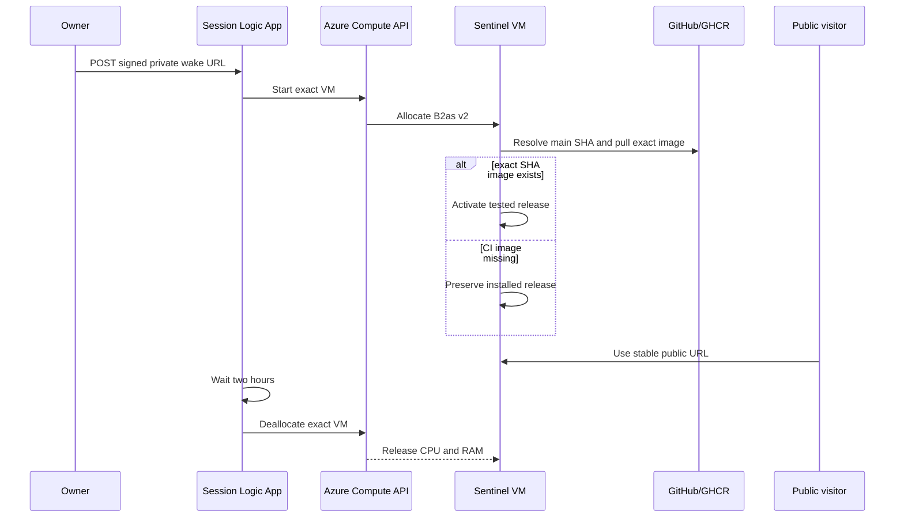

# Azure FinOps for an on-demand portfolio demo

This note explains why an apparently idle server can be expensive, how Sentinel reduces its Azure rate without faking the backend, and how to defend the design in a DevOps or system-design interview.

## Prerequisites

Know these ideas first:

- a VM **size** reserves a fixed CPU and RAM capacity;
- **utilization** is how much of that capacity the workload currently uses;
- **allocated** and **deallocated** are different billing states;
- a managed disk and static IP have independent lifecycles;
- a managed identity is a workload identity, not a stored password;
- least privilege means separating deployment, start, and emergency-stop authority.

## Plain-language definitions

- **FinOps:** engineering practices that connect cloud architecture, usage, and cost.
- **Retail meter:** a unit price such as dollars per VM hour.
- **Cost model:** a calculation from unit prices and assumed runtime. It predicts rather than guarantees a bill.
- **Deallocate:** release the VM's CPU/RAM host allocation. The VM object and disk remain.
- **Session lease:** a bounded time window after which compute is forcibly deallocated.
- **Cost floor:** resources that remain billed even when compute is off.
- **Cold start:** the delay while the VM, Docker, services, model, and application become ready.

## The original failure

Sentinel used a B4as-v2 VM continuously because the complete stack can need substantial memory:

```text
Caddy
  -> Spring Boot + Next.js static console
  -> PostgreSQL + pgvector
  -> Redis
  -> RabbitMQ
  -> Ollama qwen3:4b + embedding model
```

No visitor activity does not change the VM meter. At the reviewed rates:

```text
B4 compute: 0.0984 × 24 = $2.3616/day
64-GiB SSD: 5.28 / 30    = $0.1760/day
static IP:  0.005 × 24   = $0.1200/day
total:                       $2.6576/day
```

Docker storage was not the main daily charge. Image and log growth could eventually force a larger disk, but the already-provisioned E6 disk has a fixed monthly meter.

## The chosen request and control flow



The owner link can spend money, so it is private. The public link can use the application but cannot start infrastructure.

## Local component behavior

The 8-GiB target uses explicit ceilings:

| Service | Limit |
|---|---:|
| Ollama | 4,096 MiB |
| Sentinel JVM container | 1,280 MiB |
| PostgreSQL | 512 MiB |
| RabbitMQ | 512 MiB |
| Redis | 192 MiB |
| model-init | 128 MiB |
| Caddy | 96 MiB |
| Total | 6,816 MiB / 6.66 GiB |

The remaining memory belongs to Ubuntu, Docker, kernel page cache, networking, and transient process overhead.

Ollama uses:

- one loaded model;
- one parallel inference;
- 4,096-token context;
- two-minute chat keep-alive;
- 30-second embedding keep-alive.

The design trades some warm-model latency for a smaller safe VM.

## System-design behavior

Four failure boundaries remain separate:

1. **CI failure:** no exact-SHA image is published.
2. **VM offline:** deployment activation is deferred without starting compute.
3. **Boot update failure:** the previous installed release continues.
4. **Lease stop failure:** the separate budget deallocator remains a second containment layer.

The public application does not gain Azure credentials. The model does not gain Azure credentials. Neither can extend the VM lease.

A nightly GitHub workflow adds read-only drift detection. At 20:30 UTC it checks that the exact VM is `Standard_B2as_v2` and `VM deallocated`. It cannot start, stop, deallocate, resize, run commands, or deploy. Detection remains separate from the owner-session and budget enforcement identities so a monitoring credential cannot become another mutation path.

## Why not “scale to zero on the first HTTP request”?

True HTTP scale-to-zero is a platform feature in Azure Container Apps. The current demo, however, includes stateful PostgreSQL, RabbitMQ, Redis, persistent model files, and a CPU-heavy local model. Moving only the Spring container would leave expensive or unreliable state elsewhere. Moving all components requires a deliberate managed-persistence and model-provider design.

An always-on wake proxy would itself need compute, disk, and an edge identity. A public start endpoint would enable spend abuse. The owner-started lease is the smallest reversible change that preserves the real system today.

## Failure modes

| Failure | Symptom | Safe response |
|---|---|---|
| B2 memory pressure | OOM/restarted container | Audit `docker stats`; return to B4 but retain two-hour lease |
| CPU credits exhausted | Inference becomes very slow | Measure one full run; shorten prompts/model or use a paid inference provider later |
| Wake callback leaked | Unexpected sessions | Regenerate the Logic App callback and review activity logs |
| Logic App stop fails | VM remains running | Budget guard and manual deallocation; inspect workflow run |
| Resize capacity unavailable | Bootstrap exits after its second check | VM remains deallocated and data stays intact; retry later |
| CI completes while offline | Deploy activation steps skipped | Expected; boot activates the exact published SHA next session |
| Cost still appears high | Cost data lags or VM stayed allocated | Compare power-state activity with three daily cost snapshots |
| Disk fills | Pull/start failures | Bounded logs and image retention; inspect exact Docker totals, never global-prune blindly |

## Verification commands

```bash
# Local/source invariant check
bash deployment/azure-demo/verify-cost-controls.sh

# Azure read-only report
bash deployment/azure-demo/audit-runtime-and-cost.sh

# Exact VM state
az vm get-instance-view \
  --resource-group sentinel-demo-rg \
  --name sentinel-demo-vm \
  --query "instanceView.statuses[?starts_with(code,'PowerState/')].displayStatus | [0]" \
  --output tsv
```

`VM stopped` is still allocated and billed. The expected inactive state is `VM deallocated`.

## Interview defense

At the local level:

> I reduced resident memory, bounded logs, and retained two release images so an 8-GiB burstable VM can safely run the full stack.

At the system-design level:

> The stable IP, disk, data, and DNS outlive compute. An owner-only two-hour lease allocates compute, while delivery and emergency deallocation use separate identities.

At the engineering-interview level:

> I traced the burn to the VM retail meter rather than guessing from CPU graphs. The original model was `$2.6576/day`; the B2 two-hour model is `$0.3944/day`. CI enforces that model, but I still require delayed Cost Management evidence and a real B2 workload run before calling the optimization proven.

## Pen-and-paper exercises

1. Calculate the cost if the B2 session lasts four hours.
2. Draw which resources survive deallocation.
3. Mark which identity can start, deploy, deallocate, or delete.
4. Explain why an exact-SHA image check protects boot activation after a failed build.
5. List two reasons actual cost can differ from the retail model.
6. Design a future Container Apps migration without placing PostgreSQL on ephemeral storage.

## Official references

- [Azure VM states and billing](https://learn.microsoft.com/en-us/azure/virtual-machines/states-billing)
- [Azure B-family sizes](https://learn.microsoft.com/en-us/azure/virtual-machines/sizes/general-purpose/b-family)
- [Resize a Linux VM](https://learn.microsoft.com/en-us/azure/virtual-machines/linux/tutorial-manage-vm#resize-a-vm)
- [Azure Logic Apps managed identities](https://learn.microsoft.com/en-us/azure/logic-apps/authenticate-with-managed-identity)
- [Azure budgets and delayed cost data](https://learn.microsoft.com/en-us/azure/cost-management-billing/costs/tutorial-acm-create-budgets)
- [Azure Container Apps scale to zero](https://learn.microsoft.com/en-us/azure/container-apps/scale-app)
- [Azure Retail Prices API](https://learn.microsoft.com/en-us/rest/api/cost-management/retail-prices/azure-retail-prices)
